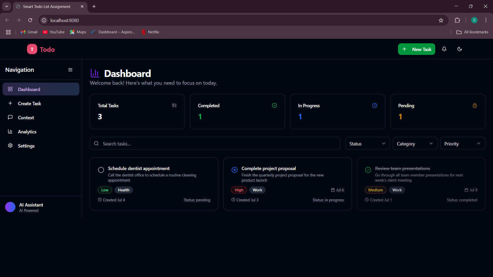
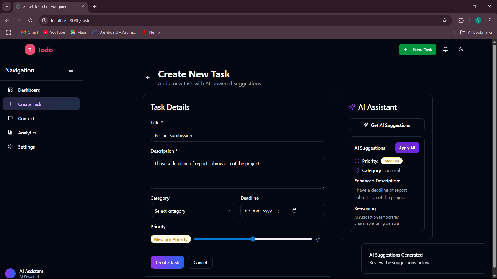
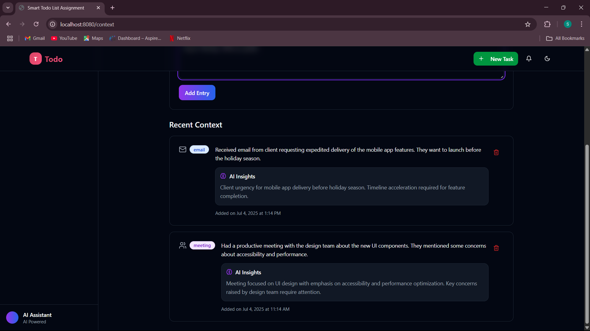
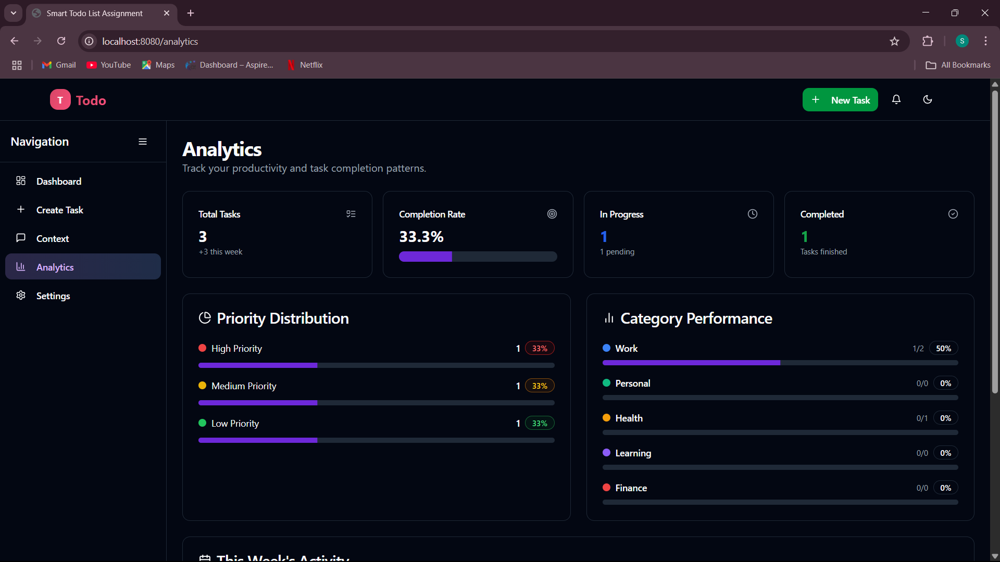

# Smart Todo List - AI-Powered Task Management

A full-stack Smart Todo List application with AI features for intelligent task management. Built with React, Express, TypeScript, and OpenAI integration.

## 📸 Screenshots

### 🏠 Dashboard



---

### ✍️ AI-Powered Task Creation



---

### 📄 Context Management



---

### 📄 Analytics




## ✨ Features

### 🎯 Core Functionality

- **Intelligent Task Management** - Create, edit, and organize tasks with smart categorization
- **AI-Powered Suggestions** - Get intelligent priority scoring, deadline estimates, and enhanced descriptions
- **Context-Aware Intelligence** - Add daily context to improve AI suggestions
- **Real-time Updates** - Live task status updates and seamless UI interactions
- **Advanced Filtering** - Filter tasks by status, category, and priority
- **Modern UI/UX** - Beautiful, responsive design with dark mode support

### 🤖 AI Features

- **Smart Priority Scoring** - AI analyzes task content and context to suggest optimal priority levels
- **Deadline Estimation** - Intelligent deadline suggestions based on task complexity and context
- **Description Enhancement** - AI improves task descriptions with context-aware details
- **Category Suggestions** - Automatic categorization based on task content
- **Context Analysis** - Extract insights from daily activities (emails, meetings, notes)

### 🎨 Design & UX

- **Modern Brand Identity** - Fresh purple-to-blue gradient theme
- **Responsive Design** - Works seamlessly on desktop, tablet, and mobile
- **Dark Mode Support** - System-aware theme switching
- **Intuitive Navigation** - Collapsible sidebar with clear navigation
- **Loading States** - Smooth loading indicators and transitions
- **Toast Notifications** - User-friendly feedback system

## 🛠️ Tech Stack

### Frontend

- **React 18** - Modern React with hooks and functional components
- **TypeScript** - Full type safety across the application
- **React Router 6** - SPA routing with seamless navigation
- **TailwindCSS** - Utility-first CSS framework with custom design system
- **Radix UI** - Accessible, unstyled UI components
- **Tanstack Query** - Server state management
- **Lucide React** - Beautiful, consistent icons

### Backend

- **Express.js** - Fast, unopinionated web framework
- **TypeScript** - Type-safe server-side code
- **OpenAI API** - GPT-powered AI suggestions and analysis
- **In-memory Storage** - Ready for database migration (Supabase/PostgreSQL)

### Development

- **Vite** - Lightning-fast build tool and dev server
- **ESLint & Prettier** - Code quality and formatting
- **Vitest** - Modern testing framework

## 🚀 Quick Start

### Prerequisites

- Node.js 18+ and npm
- OpenAI API key (optional, for AI features)

### Installation

1. **Clone and install dependencies**

```bash
git clone <repository-url>
cd smart-todo-list
npm install
```

2. **Set up environment variables** (optional)

```bash
# Create .env file for OpenAI integration
echo "OPENAI_API_KEY=your_openai_api_key_here" > .env
```

3. **Start the development server**

```bash
npm run dev
```

4. **Open your browser**
   Navigate to `http://localhost:8080` to see the application running.

## 📁 Project Structure

```
smart-todo-list/
├── client/                 # React frontend
│   ├── components/
│   │   ├── ui/            # Reusable UI components (Radix + Tailwind)
│   │   ├─�� Header.tsx     # App header with navigation
│   │   ├── Sidebar.tsx    # Collapsible navigation sidebar
│   │   └── TaskCard.tsx   # Task display component
│   ├── pages/             # Route components
│   │   ├── Dashboard.tsx  # Main dashboard with task overview
│   │   ├── TaskForm.tsx   # Create/edit tasks with AI suggestions
│   │   ├── Context.tsx    # Daily context management
│   │   ├── Analytics.tsx  # Analytics placeholder
│   │   └── Settings.tsx   # User preferences and configuration
│   └── lib/
│       └── utils.ts       # Utility functions
├── server/                # Express backend
│   ├── routes/           # API endpoints
│   │   ├── tasks.ts      # Task CRUD operations
│   │   ├── categories.ts # Category management
│   │   ├── context.ts    # Context entry management
│   │   └── ai-suggestions.ts # AI-powered suggestions
│   └── services/
│       ├── ai-engine.ts  # OpenAI integration
│       └── data-store.ts # In-memory data storage
└── shared/               # Shared types and utilities
    └── types.ts          # TypeScript interfaces
```

## 🎮 Usage Guide

### Creating Tasks

1. Click "New Task" in the header or navigate to `/task`
2. Fill in the title and description
3. Click "Get AI Suggestions" for intelligent recommendations
4. Apply AI suggestions or customize manually
5. Save your task

### Managing Context

1. Navigate to the Context page (`/context`)
2. Add daily context from emails, meetings, notes
3. AI will analyze context to improve future task suggestions
4. Context entries are automatically processed for insights

### Dashboard Features

- **Task Cards**: Click status icons to update task progress
- **Filtering**: Use status, category, and priority filters
- **Search**: Find tasks quickly with the search bar
- **Quick Actions**: Edit, delete, or change task status from card menus

## 🔧 API Documentation

### Tasks

- `GET /api/tasks` - Retrieve all tasks (with optional filters)
- `GET /api/tasks/:id` - Get specific task
- `POST /api/tasks` - Create new task
- `PUT /api/tasks/:id` - Update existing task
- `DELETE /api/tasks/:id` - Delete task

### Categories

- `GET /api/categories` - Get all categories with usage counts
- `POST /api/categories` - Create new category

### Context

- `GET /api/context` - Retrieve context entries
- `POST /api/context` - Add new context entry (with AI analysis)
- `DELETE /api/context/:id` - Remove context entry

### AI Suggestions

- `POST /api/ai-suggestions` - Generate AI-powered task suggestions

## 🎨 Customization

### Theme Colors

Modify `client/global.css` and `tailwind.config.ts` to customize the color scheme:

```css
:root {
  --primary: 262.1 83.3% 57.8%; /* Purple primary */
  --priority-low: 142.1 76.2% 36.3%; /* Green for low priority */
  --priority-medium: 47.9 95.8% 53.1%; /* Yellow for medium */
  --priority-high: 0 84.2% 60.2%; /* Red for high priority */
}
```

### Adding New Categories

Categories are automatically managed, but you can add defaults in `server/services/data-store.ts`.

## 📸 Screenshots

### Dashboard

- Clean, modern interface with task overview
- Smart filtering and search capabilities
- Real-time task status updates

### AI-Powered Task Creation

- Intelligent suggestions for priority, category, and deadlines
- Context-aware description enhancements
- One-click application of AI recommendations

### Context Management

- Easy input for daily activities
- Automatic AI analysis and insight extraction
- Historical context tracking


